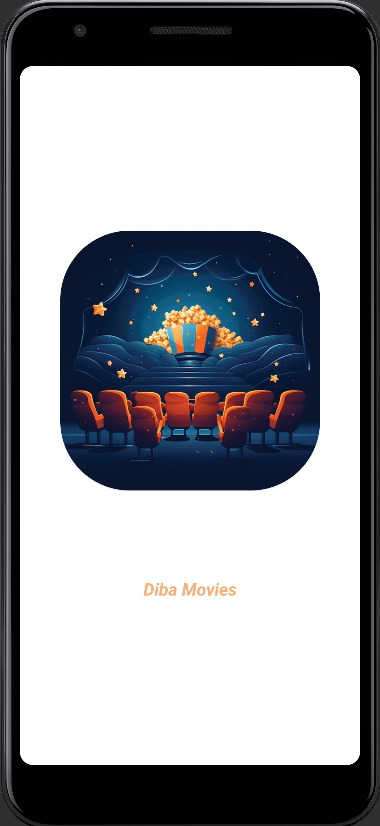
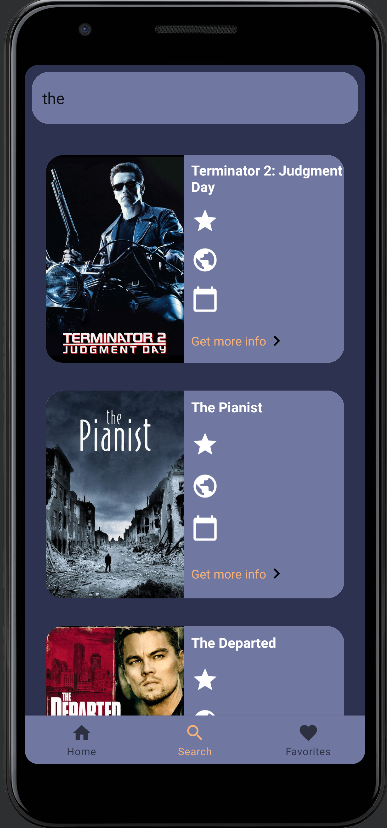

# Android Programming - Movie Application

## Project Report

**Prepared by:**  
**Ali Maher**

## Introduction

This project involved designing and implementing a complete Android application to display movie data from a server. The application features five main screens, adhering to the **MVVM architecture pattern**, with additional requirements and potential features.

## Project Overview

### Screens and Implementation Details

1. **Splash Screen**
   - Displayed upon the first app install and on every subsequent launch.
   - Navigates to the Register Screen if the user is not logged in.
   - Navigates to the Home Screen if the user is already logged in.

2. **Register Screen** 
   - Collects user data and handles errors.
   - Validates inputs using regex for name, student number, email, and password.
   - Handles input types correctly.
   - Encrypts the user password using MD5 before sending it to the server.
   - Upon successful registration, navigates to the Home Screen.

3. **Home Screen** 
   - Displays a top recycler view with a half-image drag scroll.
   - Fetches movie data from a JSON collection.
   - Shows a list of all genres and movies within the selected genre.
   - Navigates to the Detail Screen on movie click.
   - Clicking a genre opens a new page displaying all movies in that genre.
   - Top items change with a static time duration.

4. **Detail Screen**
   - Scrollable view with a horizontal recycler for movie images.
   - Images fade in with animations and load from the server.
   - A favorite icon adds the movie to the favorites database.
   - A back icon returns to the previous screen.

5. **Search Screen**
   - Implements real-time search functionality.
   - Searches dynamically with every change in the search query.
   - Navigates to the Detail Screen on movie click.
   - Images load with animations from the server.

6. **Favorite Screen**
   - Displays movies added to the favorites database.
   - Shows the latest added item at the top.
   - Initially empty.
  
 

## **MVVM Architecture Implementation**

**Model-View-ViewModel (MVVM)** is a software architectural pattern that promotes a clean and maintainable codebase by separating the UI and business logic.

### **Key Concepts in My MVVM Implementation:**

- **Model**: Manages data logic and server communication. For this project, it fetches movie data from the server.
- **View**: Consists of UI components such as activities, fragments, and XML layouts.
- **ViewModel**: Bridges the View and Model, handling data presentation logic and updating the View with data from the Model.

### **Project Structure**

- **Model**: Contains data models and repository classes for data handling.
- **View**: Includes activity and fragment classes for UI representation.
- **ViewModel**: Manages UI-related data and communicates between the View and Model.

## Additional Features

- **Dependency Injection (DI)**: Utilized Hilt for dependency injection.
- **Paging**: Implemented movie paging.
- **Responsive Design**: Ensured the app is reactive and supports all device sizes and orientations, including landscape mode.
- **Custom Themes**: Implemented custom themes as per personal preference.
- **Fragments and Fragment Managers**: Used fragments and fragment managers for UI navigation.
- **Other Cool Features**: Added dynamic genre pages and static time duration changes for top items.

## Repository Contents

- **app/src/main/java/com/yourprojectname/**:
  - **model/**: Data models and repository classes.
  - **view/**: Activity and fragment classes for UI representation.
  - **viewmodel/**: ViewModel classes to handle UI-related data.

- **app/src/main/res/layout/**: XML layout files defining the user interface.
- **app/src/main/AndroidManifest.xml**: Application components definition.
